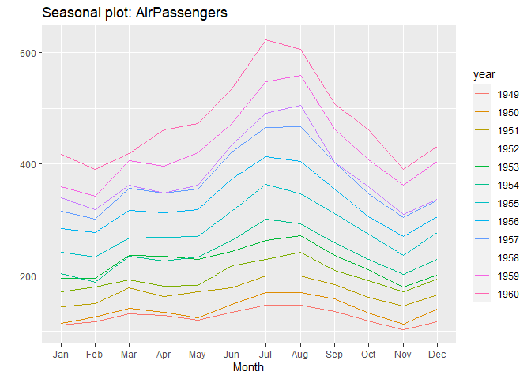
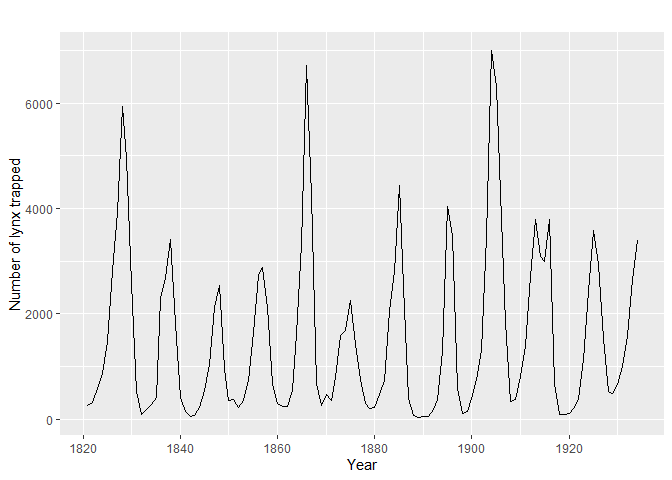

Guía Definitiva para el Marketing Mix Modelling
================

## Introducción

Ya sea que se trate de una empresa establecida o bastante nueva en el
mercado, casi todas las empresas utilizan diferentes canales de
marketing como televisión, radio, correo electrónico, redes sociales,
etc., para llegar a sus clientes potenciales y aumentar el conocimiento
de su producto y, a su vez, maximizar las ventas o ingresos.

Pero con tantos canales de marketing a su disposición, las empresas
deben decidir qué canales de marketing son eficaces en comparación con
otros y, lo que es más importante, cuánto presupuesto se debe asignar a
cada canal. Con el surgimiento del marketing online y varias plataformas
y herramientas de big data, el marketing es una de las áreas de
oportunidades más destacadas para las aplicaciones de ciencia de datos y
aprendizaje automático.

<strong>Objetivos de aprendizaje</strong>
</p>
<ol>
<li>
¿Qué es el Marketing Mix Modelling y por qué MMM con Robyn es mejor que
un MMM tradicional?
</li>
<li>
Componentes de las series temporales: tendencia, estacionalidad,
ciclicidad, ruido, etc.
</li>
<li>
Adstocks publicitarios: efecto de arrastre y efecto de rendimientos
decrecientes, y transformación de Adstock: geométrico, Weibull CDF y
Weibull PDF.
</li>
<li>
¿Qué son la optimización sin gradientes y la optimización de
hiperparámetros multiobjetivo con Nevergrad?
</li>
<li>
Implementación del Marketing Mix Modelling utilizando Robyn.
</li>
</ol>

Entonces, sin más preámbulos, demos el primer paso para comprender cómo
implementar el Marketing Mix Modelling utilizando la biblioteca Robyn
desarrollada por el equipo de Facebook (ahora Meta) y, lo más
importante, cómo interpretar los resultados de salida.

## Estacionalidad

Si observa un ciclo periódico en la serie con frecuencias fijas,
entonces puede decir que hay una estacionalidad en los datos. Estas
frecuencias pueden ser diarias, semanales, mensuales, etc. En palabras
simples, la estacionalidad siempre es de un período fijo y conocido, lo
que significa que notará una cantidad de tiempo definida entre los picos
y los valles de los datos; ergo, a veces, las series de tiempo
estacionales también se denominan series de tiempo periódicas. no Por
ejemplo, las ventas minoristas aumentan en algunos festivales o eventos
en particular, o la temperatura del clima muestra su comportamiento
estacional de días cálidos en verano y días fríos en invierno, etc.

``` r
library(forecast) # Librería clásica de Pronósticos
```

    ## Warning: package 'forecast' was built under R version 4.2.3

    ## Registered S3 method overwritten by 'quantmod':
    ##   method            from
    ##   as.zoo.data.frame zoo

``` r
ggseasonplot(AirPassengers)
```

<!-- -->

``` r
library(fpp2) # Librería con la información para ilustrar ***
```

    ## Warning: package 'fpp2' was built under R version 4.2.3

    ## ── Attaching packages ────────────────────────────────────────────── fpp2 2.5 ──

    ## ✔ ggplot2   3.4.2     ✔ expsmooth 2.3  
    ## ✔ fma       2.5

    ## Warning: package 'ggplot2' was built under R version 4.2.3

    ## Warning: package 'fma' was built under R version 4.2.3

    ## Warning: package 'expsmooth' was built under R version 4.2.3

    ## 

``` r
autoplot(lynx) + xlab("Anio") + ylab("Número de linces atrapados")
```

<!-- -->

## Paso 1: Instalar los paquetes adecuados

``` r
#Paso 1.a.Primera instalación de los paquetes necesarios, descomentar la primera vez
#install.packages("Robyn")
#install.packages("reticulate")
library(reticulate)
```

    ## Warning: package 'reticulate' was built under R version 4.2.3

``` r
library(Robyn)
```

    ## Warning: package 'Robyn' was built under R version 4.2.3

``` r
#Paso 1.b Configurar el entorno virtual e instalar la biblioteca Nevergrad
virtualenv_create("r-reticulate")
```

    ## virtualenv: r-reticulate

``` r
py_install("nevergrad", pip = TRUE)
#use_virtualenv("r-reticulate", required = TRUE) #Descomentar esta parte la primera vez
```

``` r
#Paso 1.c Importar paquetes y configurar CWD
library(Robyn) 
library(reticulate)
set.seed(123)

setwd('MMM')
```

``` r
#Paso 1.d Puedes forzar el uso de múltiples núcleos ejecutando la siguiente línea de código
Sys.setenv(R_FUTURE_FORK_ENABLE = "true")
options(future.fork.enable = TRUE)

# Puedes configurar create_files en FALSE para evitar la creación de archivos localmente
create_files <- TRUE
```

## Paso 2: Cargar Datos

``` r
#Paso 2.a Cargar datos
data("dt_simulated_weekly")
head(dt_simulated_weekly)
```

    ## # A tibble: 6 × 12
    ##   DATE        revenue    tv_S  ooh_S print_S facebook_I search_clicks_P search_S
    ##   <date>        <dbl>   <dbl>  <dbl>   <dbl>      <dbl>           <dbl>    <dbl>
    ## 1 2015-11-23 2754372.  67075. 0       38185.  72903853.              0         0
    ## 2 2015-11-30 2584277.  85840. 0           0   16581100.          29512.    12400
    ## 3 2015-12-07 2547387.      0  3.97e5   1362.  49954774.          36132.    11360
    ## 4 2015-12-14 2875220  250351. 0       53040   31649297.          36804.    12760
    ## 5 2015-12-21 2215953.      0  8.32e5      0    8802269.          28402.    10840
    ## 6 2015-12-28 2569922.  99676. 0       95767.  49902081.          38062.    11320
    ## # ℹ 4 more variables: competitor_sales_B <int>, facebook_S <dbl>, events <chr>,
    ## #   newsletter <dbl>

``` r
#Paso 2.b Cargar datos de vacaciones desde Prophet
data("dt_prophet_holidays")
head(dt_prophet_holidays)
```

    ## # A tibble: 6 × 4
    ##   ds         holiday                                               country  year
    ##   <date>     <chr>                                                 <chr>   <int>
    ## 1 1995-01-01 Ano Nuevo [New Year's Day]                            AR       1995
    ## 2 1995-02-27 Dia de Carnaval [Carnival's Day]                      AR       1995
    ## 3 1995-02-28 Dia de Carnaval [Carnival's Day]                      AR       1995
    ## 4 1995-03-24 Dia Nacional de la Memoria por la Verdad y la Justic… AR       1995
    ## 5 1995-04-02 Dia del Veterano y de los Caidos en la Guerra de Mal… AR       1995
    ## 6 1995-04-13 Semana Santa (Jueves Santo)  [Holy day (Holy Thursda… AR       1995

``` r
# Exportar resultados al directorio deseado
robyn_object<- "~/MyRobyn.RDS"
```

## Paso 3: Especificación del Modelo

### Paso 3.1 Definir variables de entrada

Dado que Robyn es una herramienta semiautomática, usar una tabla como la
siguiente puede ser valioso para ayudar a articular variables
independientes y de destino para su modelo:

## Problema 1

La base de datos `CARS2004` del paquete `PASWR2` recoge el número de
coches por 1000 habitantes (`cars`), el número total de accidentes con
víctimas mortales (`deaths`) y la población/1000 (`population`) para los
25 miembros de la Unión Europea en el año 2004.

1.  Proporciona con `R` resumen de los datos.
2.  Utiliza la función `eda` del paquete `PASWR2` para realizar un
    análisis exploratorio de la variable `deaths`

### Apartado 1

``` r
library(PASWR2)
```

    ## Warning: package 'PASWR2' was built under R version 4.2.3

    ## Loading required package: lattice

``` r
summary(CARS2004) 
```

    ##            country        cars           deaths        population   
    ##  Austria       : 1   Min.   :222.0   Min.   : 33.0   Min.   :  400  
    ##  Belgium       : 1   1st Qu.:354.0   1st Qu.: 72.0   1st Qu.: 3446  
    ##  Cyprus        : 1   Median :448.0   Median :112.0   Median : 8976  
    ##  Czech Republic: 1   Mean   :432.1   Mean   :111.4   Mean   :18273  
    ##  Denmark       : 1   3rd Qu.:491.0   3rd Qu.:135.0   3rd Qu.:16258  
    ##  Estonia       : 1   Max.   :659.0   Max.   :222.0   Max.   :82532  
    ##  (Other)       :19

Como puedes observar, al compilar tu documento aparecen las sentencias
de `R` y el output que te da el programa.

### Apartado 2

Ahora vamos a utilizar la función `eda` del paquete `PASWR2` para
realizar un análisis exploratorio de la variable `deaths`

``` r
eda(CARS2004$deaths)
```

<!-- -->

    ## Size (n)  Missing  Minimum   1st Qu     Mean   Median   TrMean   3rd Qu 
    ##   25.000    0.000   33.000   72.000  111.400  112.000  110.000  135.000 
    ##      Max    Stdev      Var  SE Mean   I.Q.R.    Range Kurtosis Skewness 
    ##  222.000   47.023 2211.167    9.405   63.000  189.000    0.043    0.578 
    ## SW p-val 
    ##    0.243

En este caso, en tu documento final te aparece el código de `R`, el
output numérico de la función `eda` y el output gráfico de la función
`eda`.
